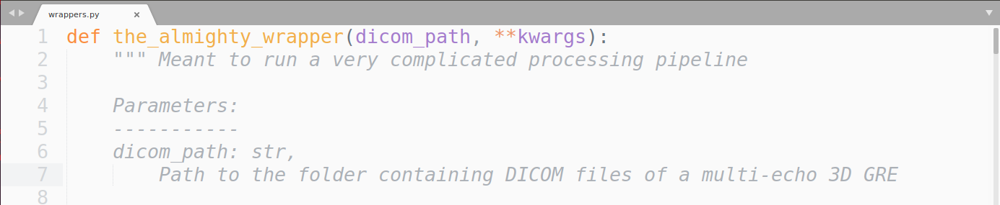
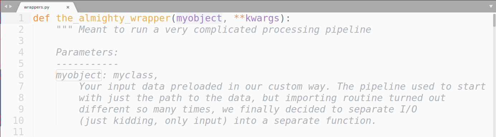
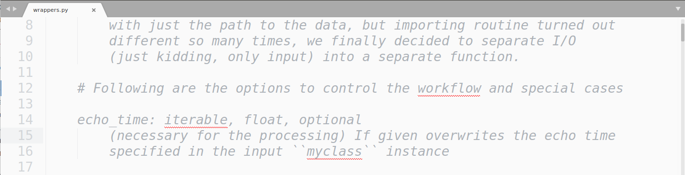
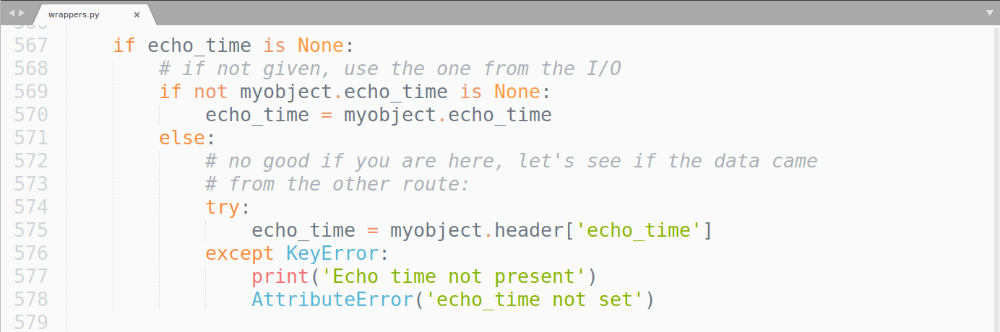
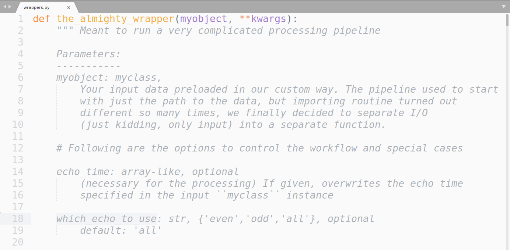

# When running a complicated pipeline

* might evolve like living beings (working but not optimal solutions are not revisited (:thumbsdown:)
* once need to apply to a project, want it to be wrapped and easy to apply :question:
  -> enter! 

## The Almighty Wrapper
  
   (with ``the_path`` in the argument)

### OK, we give up on the input
* then you apply it to a bit of a different data and it quickly becomes too much of a pain to maintain meaningfull import wrapped, 
  -> so enter!
  
 

...because there has to be something unified for the rest of the pipeline to build on top :question:

**IMHO:** 
* :good: maybe consider standardized data organization (e.g. BIDS)
* :questionable: much like in Hawkings' someone-elses-words each formula halves the number of readers... $E = mc^2$
Each custom class incorporated in the core of the algorithms reduces the number of people contributing to the code (we all love numpy or reimplementing algos from matlab's scratch). Plus, you pay the penalty of calling API of your custom objects in algorithms.

### If ``myobject``-abstraction [leaks](https://en.wikipedia.org/wiki/Leaky_abstraction)...

 

..you want to add a hook!.. :thumbsdown:

(to control corrupted object [the world is imperfect, some data come inconsistent]) 

 

(But then if you add the hook, it must have priority over the object, so the flow control starts to build up, and in some other dataset ther might be other source of metainformation)
**IMHO:** separate preprocessing run to normalize and unify the data

### New adventures of the almighty wrapper
You get a GRE dataset with a bipolar readout, low BW. (Incorporating a correction in the pipeline already hurts a bit, so you decide to simply stick to the echoes of the same polarity. Since now we are already on the path of jamming more control variables in the script, we'll just smash more:

 

### Orchestration work comes

(Now, it gets serious. You discovered, a method, say, 'cauchy-gauss' only works on the dataset with less than 5 echoes. So you update an indexing variable , 